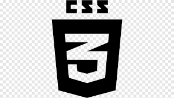

### Hi there !I'm **Abhishek Kumar Vikrant** 👋

- 🔭 I’m currently working on my academic projects.
- 🌱 I’m currently learning full stack tech using MERN.
- 👯 I’m looking to collaborate on open source.
- 🤔 I’m looking for help with full stack tech and resources to learn.
- 💬 Ask me about git, Java Programming and coding problems, open source GitHub, HTML, CSS, Javascript and ReactJs.
- 📫 How to reach me:
<h4 align="center">
  💬 connect 
  💬 connect  
  💬 connect  
  💬 connect  
    </h4>

- 😄 Pronouns: You can call me *Abhishek* or *Vikrant* or *Abhi*.
- ⚡ Fun fact: BulletLover, TechLover and love to cook!!

**Languages and Tools:**

<code></code>
<code></code>
<code></code>
<code></code>
<code></code>
<code></code>

